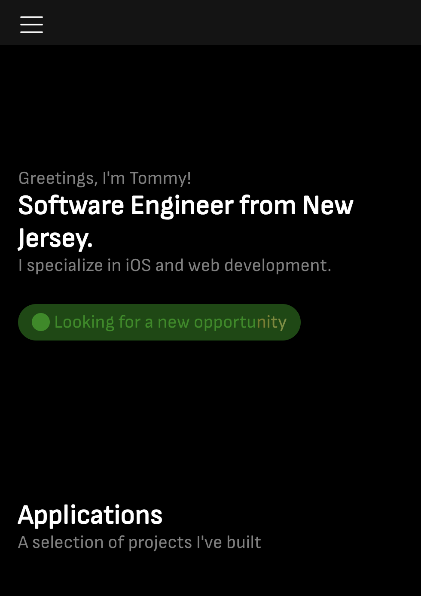
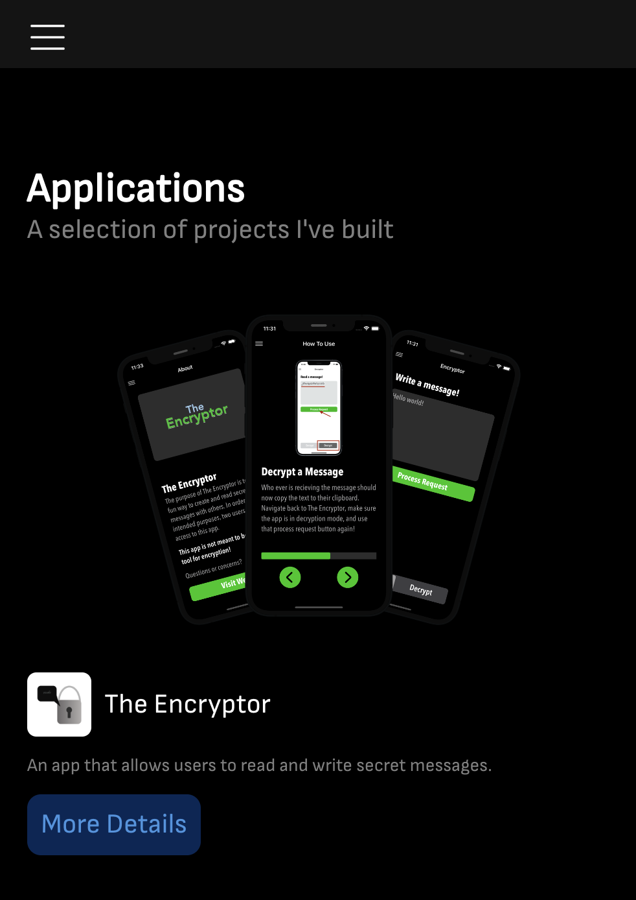
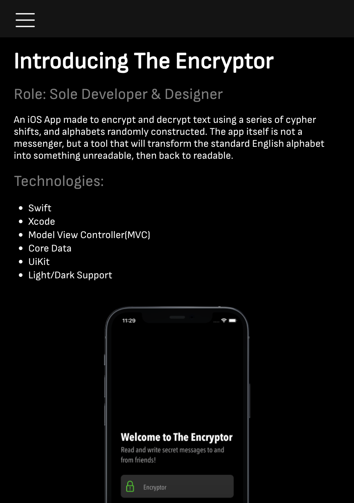

# [tommybartocci.com](https://tommybartocci.com)

Welcome to my portfolio website built using React. I chose react because I come from a mobile development background. React allows me to utilize component based views similiar to how I would previously. I made this site in hopes of standing out in the world of job searching.

### The tech I used:
- 
- 
- 
- 

### Next steps:
- Create more content to populate the site
- Create a new nav bar
- Add a contact section
- Add a blog section

### Here is a video of it in action:

 
